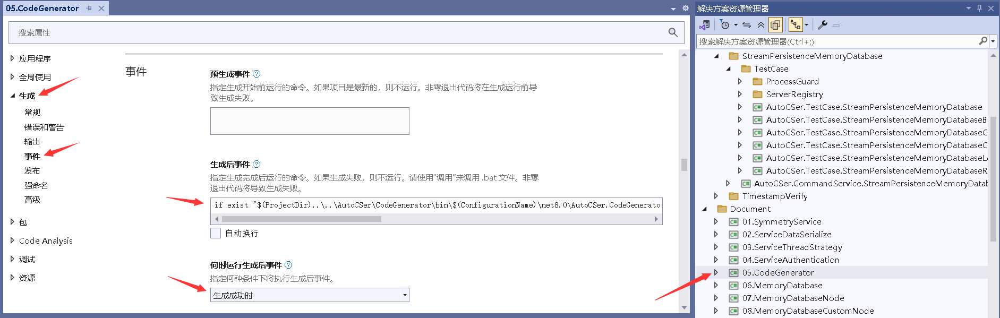

# Static code generation
Although Emit can address the need for dynamic code generation at runtime, there are always some requirements that are more suitable for using static code generation techniques to solve (for example, the intermediate code generated may need to be used in an IDE), and in [AOT](https://github.com/AutoCSer/AutoCSer2/blob/main/Document/12.NativeAOT/12.NativeAOT.Eng.md) environments where Emit cannot be used, static code generation techniques often need to be introduced to solve the problem.  
The static code generation of AutoCSer is not the official Source Generator solution of Microsoft, but an implementation based on a simple [custom template](https://github.com/AutoCSer/AutoCSer2/tree/main/AutoCSer/CodeGenerator/Template) engine **customized for the requirements of the AutoCSer framework**. The specific supported project is [AutoCSer.CodeGenerator.NET8.csproj](https://github.com/AutoCSer/AutoCSer2/tree/main/AutoCSer/CodeGenerator). It provides data sources for code templates by reading metadata information related to the target assembly, similar to the MV* template technology in WEB development.  
The feature of the AutoCSer static code generation component is that the **C# template code is also required to be compilable** (not text templates). The main code in the template, except for instructions, is basically regular code. Such template code can sense most of the refactoring operations of the dependent project and has good maintainability.  
To use the AutoCSer static code generation function, you need to click the **Event** option under the **Generate** menu of the VS project properties, and enter the following code in the **Post-Generate Event** input box (note that the real path of AutoCSer.CodeGenerator.exe needs to be modified according to different platform versions) :
``` text
if exist "C:\AutoCSer\CodeGenerator\bin\Release\net8.0\AutoCSer.CodeGenerator.exe" C:\AutoCSer\CodeGenerator\bin\Release\net8.0\AutoCSer.CodeGenerator.exe "$(ProjectName)" "$(ProjectDir) " "$(TargetPath) " "$(RootNamespace)"
```

Essentially, when the assembly of the project is successfully generated, VS will trigger a post-generation event call to AutoCSer.CodeGenerator.exe to generate static code. Under normal circumstances, a C# code file named **{$(ProjectName)}.AutoCSer.cs** will be generated in the directory $(TargetPath). In non-IDE environments, you can manually invoke the command line to replace the environment variables with their actual values.  
If the code to be generated contains the XML document of the API, you need to click the **Output** option under the **Generate** menu and check the **Document File** option. In this way, the XML document file of the assembly will be generated.
# RPC
Due to the different thread scheduling requirements of the client and the server, the interface API definitions of the client and the server are also different. We can add [AutoCSer.Net.CommandServerControllerInterfaceAttribute](https://github.com/AutoCSer/AutoCSer2/blob/main/AutoCSer/Net/CommandServer/CommandServerControllerInterfaceAttribute.cs) configuration to the [service interface](https://github.com/AutoCSer/AutoCSer2/blob/main/Document/05.CodeGenerator/Service/IServiceController.cs), and in this way, the default [client interface API definition](https://github.com/AutoCSer/AutoCSer2/blob/main/Document/05.CodeGenerator/%7BAutoCSer.Document.CodeGenerator%7D.AutoCSer.cs) can be generated.
``` csharp
    /// <summary>
    /// An example of generate the API definition of the client controller interface
    /// </summary>
    [AutoCSer.Net.CommandServerControllerInterface]
    public partial interface IServiceController
    {
        /// <summary>
        /// Test API
        /// </summary>
        /// <param name="left"></param>
        /// <param name="right"></param>
        /// <returns></returns>
        int Add(int left, int right);
    }
```
``` csharp
        /// <summary>
        /// An example of generate the API definition of the client controller interface 
        /// </summary>
        public partial interface IServiceControllerClientController
        {
            /// <summary>
            /// Test API
            /// </summary>
            /// <param name="left"></param>
            /// <param name="right"></param>
            /// <returns></returns>
            AutoCSer.Net.ReturnCommand<int> Add(int left, int right);
        }
```
# In-memory database
The server of the in-memory database node only supports the synchronous scheduling mode of queue threads, while the client only supports the await asynchronous scheduling mode. Therefore, the API definitions of the node interface between the client and the server are different. It is necessary to add [AutoCSer.CommandService.StreamPersistenceMemoryDatabase.ServerNodeAttribute](https://github.com/AutoCSer/AutoCSer2/blob/main/Application/StreamPersistenceMemoryDatabase/Server/ServerNodeAttribute.cs) configuration to the [server node interface](https://github.com/AutoCSer/AutoCSer2/blob/main/Document/05.CodeGenerator/MemoryDatabase/IServerNode.cs), so that the default API definition of the client node interface can be generated.
``` csharp
    /// <summary>
    /// An example of generate the API definition of the client node interface
    /// </summary>
    [AutoCSer.CommandService.StreamPersistenceMemoryDatabase.ServerNode]
    public partial interface IServerNode
    {
        /// <summary>
        /// Test API
        /// </summary>
        /// <param name="left"></param>
        /// <param name="right"></param>
        /// <returns></returns>
        int Add(int left, int right);
    }
```
``` csharp
        /// <summary>
        /// An example of generate the API definition of the client node interface 
        /// </summary>
        [AutoCSer.CommandService.StreamPersistenceMemoryDatabase.ClientNode(typeof(AutoCSer.Document.CodeGenerator.MemoryDatabase.IServerNode))]
        public partial interface IServerNodeClientNode
        {
            /// <summary>
            /// Test API
            /// </summary>
            /// <param name="left"></param>
            /// <param name="right"></param>
            /// <returns></returns>
            AutoCSer.CommandService.StreamPersistenceMemoryDatabase.ResponseParameterAwaiter<int> Add(int left, int right);
        }
```
The [local embedding mode](https://github.com/AutoCSer/AutoCSer2/blob/main/Document/05.CodeGenerator/MemoryDatabase/ILocalNode.cs) requires **setting IsLocalClient to true** for the local client node interface API definition to be generated.
``` csharp
    /// <summary>
    /// An example of generate the API definition of the local client node interface
    /// </summary>
    [AutoCSer.CommandService.StreamPersistenceMemoryDatabase.ServerNode(IsLocalClient = true, IsClient = false)]
    public partial interface ILocalNode
    {
        /// <summary>
        /// Test API
        /// </summary>
        /// <param name="left"></param>
        /// <param name="right"></param>
        /// <returns></returns>
        int Add(int left, int right);
    }
```
``` csharp
        /// <summary>
        /// An example of generate the API definition of the local client node interface 
        /// </summary>
        [AutoCSer.CommandService.StreamPersistenceMemoryDatabase.ClientNode(typeof(AutoCSer.Document.CodeGenerator.MemoryDatabase.ILocalNode))]
        public partial interface ILocalNodeLocalClientNode
        {
            /// <summary>
            /// Test API
            /// </summary>
            /// <param name="left"></param>
            /// <param name="right"></param>
            /// <returns></returns>
            AutoCSer.CommandService.StreamPersistenceMemoryDatabase.LocalServiceQueueNode<AutoCSer.CommandService.StreamPersistenceMemoryDatabase.LocalResult<int>> Add(int left, int right);
        }
```
# [Introduction to in-memory database](https://github.com/AutoCSer/AutoCSer2/blob/main/Document/06.MemoryDatabase/06.MemoryDatabase.Eng.md)